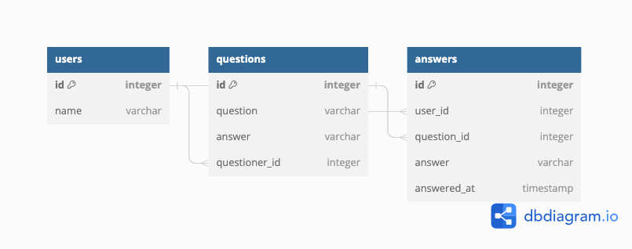

# 発表アジェンダ

## デモ

みんなも触ってみよう！

```
curl https://nuuuuuuuuuuu-8389623ca042.herokuapp.com/users
curl -X POST http://localhost:8080/users -d '{"name":"hoge"}' -H 'Content-Type: application/json'
curl https://nuuuuuuuuuuu-8389623ca042.herokuapp.com/users
```

## 学んだこと・取り組んだこと

### kumackey


### kerochelo

### kenchasonakai

### miloneko

### watsumi

# 開発

```bash
# ユーザー一覧取得
curl http://localhost:8080/users

# ユーザからの回答提出
curl -X POST http://localhost:8080/qustions/1/answers -d '{"answer": "阿蘇山", "user_name":"kumackey"}' -H 'Content-Type: application/json'
```

## データベース

### 設計



### データベース接続

```bash
docker compose up -d
docker compose exec postgres bash

psql -U postgres

# 以下は初期接続のときのみ
CREATE DATABASE rust_rest_api;
\c rust_rest_api
```

### データベースリセット

```
docker compose down -v
docker compose up -d
```

### マイグレーション

```bash
docker compose exec rust diesel migration run
```

マイグレーションが成功したかは、上記のデータベース接続で select するなりで確認してください。

## テスト

```bash
# この一行はアプリケーションコードを変更したときのみ。もしかしたらbind mountしてるから要らないかも？
docker compose build

docker compose up -d
docker compose exec rust cargo test
```

ちなみにデータベースは分けてないので、テストのたびに色々データが作り直されます。

## web api サーバ立ち上げ

### docker で起動する場合(推奨)

```
docker compose up -d
```

http://localhost:8080/

アプリケーションコードをいじった場合はdocker compose up -d --buildで再起動します

### localのhost machineで起動(非推奨)

```bash
cargo run
```


